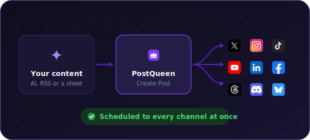
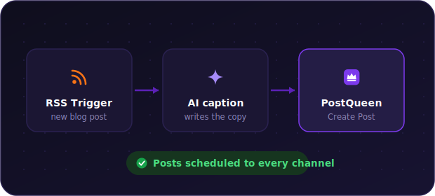
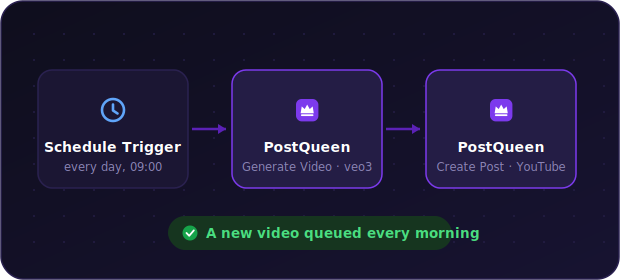
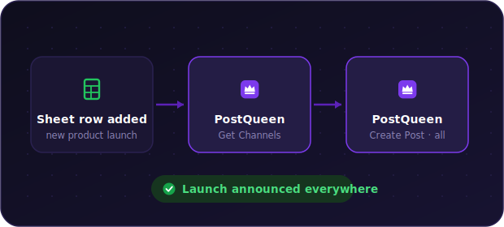
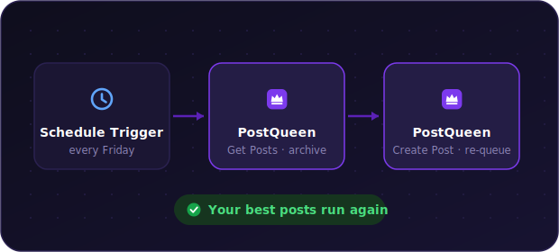
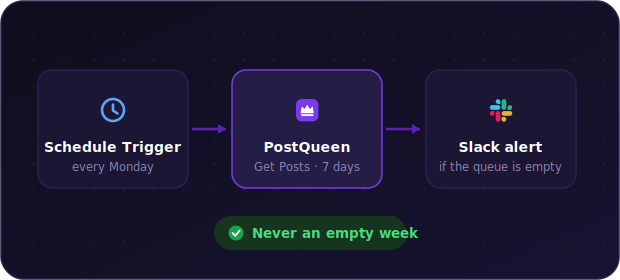

<p align="center">
  <a href="https://postqueen.ai">
    
  </a>
</p>

<h3 align="center">
  <a href="https://postqueen.ai/agent">🆕 NEW: meet the PostQueen Agent, run your social media from Claude Code, ChatGPT, OpenClaw or Hermes »</a>
</h3>

<br/>

<p align="center">
  <strong>Put your social media on an assembly line.</strong>
</p>

<p align="center">
  The official n8n community node: wire PostQueen into any workflow and let it draft, schedule and publish to 30+ networks without writing code. Nobody wakes up wanting a scheduler — people want views, subscribers and sales. This node is how n8n builders get them: every post and video, on every channel, on time, on autopilot.
</p>

<br/>

<p align="center">
  <a href="https://postqueen.ai">Website</a> &nbsp;·&nbsp;
  <a href="https://postqueen.ai/pricing">Pricing</a> &nbsp;·&nbsp;
  <a href="https://docs.postqueen.ai">Docs</a> &nbsp;·&nbsp;
  <a href="https://api.postqueen.ai/docs">API Reference</a> &nbsp;·&nbsp;
  <a href="https://postqueen.ai/agent">Agents</a> &nbsp;·&nbsp;
  <a href="https://postqueen.ai/mcp">MCP</a> &nbsp;·&nbsp;
  <a href="https://www.npmjs.com/package/postqueen">CLI</a>
</p>

<p align="center">
  <a href="https://www.npmjs.com/package/n8n-nodes-postqueen"></a>
  <a href="https://www.npmjs.com/package/n8n-nodes-postqueen"></a>
  <a href="https://github.com/GkhanKINAY/postqueen-n8n/blob/main/LICENSE.md"></a>
  <a href="https://docs.n8n.io/integrations/community-nodes/"></a>
</p>

---

## 🔁 What you can build

Seven workflows this node makes trivial — every PostQueen step below is a real operation of the node, and any n8n trigger (Schedule, RSS, Webhook, Google Sheets, a form) can start them.

### 🌐 Write once, publish everywhere

The core move: whatever your workflow produces — an AI draft, an RSS item, a row from a sheet — one **Create Post** schedules and publishes it to every channel you have, in a single step. X, Instagram, TikTok, YouTube, LinkedIn, Facebook, Threads, Discord, Bluesky and 20+ more.

<p align="center">
  
</p>

### 📰 Blog on autopilot

An **RSS trigger** watches your blog, an AI node writes the caption for each new article, and **Create Post** schedules it to every channel at once.

<p align="center">
  
</p>

### 🎬 Grow a YouTube channel while you sleep

A daily **Schedule Trigger** runs **Generate Video** (`veo3` or `image-text-slides`, vertical or horizontal, with your prompt — even a voiceover: list voices with **Video Function** → `loadVoices`), then **Create Post** queues the finished video to your channel. This is worth a second look: the node exposes AI video generation, an operation that not even the PostQueen CLI has.

<p align="center">
  
</p>

### 📱 One clip → TikTok, Reels and Shorts

A new video file landing in Drive, Dropbox or S3 triggers **Upload File**, and **Create Post** schedules the same clip to TikTok, Instagram and YouTube in one go — the posts array takes as many channels as you like. Upload first and pass the returned path into the post: TikTok, Instagram and YouTube only accept media from trusted domains.

<p align="center">
  
</p>

### 🚀 Launch-day announcement blast

A **form submission** or a new product row landing in a sheet kicks off a multi-channel announcement: **Get Channels** finds your accounts, **Create Post** does the rest — as a draft first if you want a human sign-off.

<p align="center">
  
</p>

### ♻️ Evergreen recycler

Every Friday, **Get Posts** pulls your archive, an AI node picks the winners, and **Create Post** re-queues the evergreen ones — your best content keeps working without anyone touching it.

<p align="center">
  
</p>

### 🛡️ Queue guard

Every Monday, **Get Posts** pulls the next seven days of your calendar; if the queue looks empty, a Slack message tells you before your followers notice.

<p align="center">
  
</p>

---

## 📦 Installation

### n8n UI (recommended)

1. Open **Settings → Community Nodes**.
2. Click **Install**.
3. Enter `n8n-nodes-postqueen` as the npm package name.
4. Click **Install**.


### npm (manual, non-Docker)

Go to your n8n installation folder (usually `~/.n8n`). If there is no `custom` folder, create one with a `package.json`, then install the package:

```bash
mkdir -p ~/.n8n/custom
cd ~/.n8n/custom
npm init -y
npm install n8n-nodes-postqueen
```

### Docker

Create a folder on your host machine for custom nodes and install the package there:

```bash
mkdir -p ~/n8n-custom-nodes
cd ~/n8n-custom-nodes
npm init -y
npm install n8n-nodes-postqueen
```

Then mount that folder into the container (host path to `/home/node/n8n-custom-nodes`) and point n8n at it:

```bash
docker run -d --name n8n \
  -v ~/n8n-custom-nodes:/home/node/n8n-custom-nodes \
  -e N8N_CUSTOM_EXTENSIONS="/home/node/n8n-custom-nodes" \
  -p 5678:5678 n8nio/n8n
```

Requires n8n running on Node.js **>=20.15**.

---

## 🔑 Credentials

The node authenticates with a **PostQueen API** credential that has two fields:

| Field | Description |
| --- | --- |
| **API Key** | Your PostQueen Public API key. Grab it at **[app.postqueen.ai/settings](https://app.postqueen.ai/settings)** (Developers → Public API → Reveal). |
| **Host** | Base URL of the PostQueen API. Defaults to `https://api.postqueen.ai` (cloud). |

To add the credential in n8n, create a new **PostQueen API** credential, paste your API key, and (if self-hosting) set the host. n8n validates it against a live test endpoint when you save.

> **Self-hosting note:** point **Host** at your own instance's API base URL. It must end with `/api`, for example `https://yourdomain.com/api`.

### ☁️ Cloud or 🐳 self-host — both work

| | ☁️ **PostQueen Cloud** | 🐳 **Self-hosted PostQueen** |
| --- | --- | --- |
| **Host** | `https://api.postqueen.ai` (the default) | `https://yourdomain.com/api` — must end with `/api` |
| **API Key** | [app.postqueen.ai/settings](https://app.postqueen.ai/settings) → Developers → Public API → Reveal | same screen on your own instance: Settings → Developers → Public API |
| **Get started** | free for 7 days, no card | [`docker compose up`](https://github.com/GkhanKINAY/postqueen-docker-compose) and you are live |

<p align="center">
  <a href="https://postqueen.ai"></a>&nbsp;&nbsp;<a href="https://github.com/GkhanKINAY/postqueen-docker-compose"></a>
</p>

---

## ⚙️ Operations

The PostQueen node exposes 7 operations:

| Operation | Description |
| --- | --- |
| **Create Post** | Schedule, draft, or immediately publish a post to one or more channels. |
| **Delete Post** | Delete a post by its ID. |
| **Generate Video** | Generate a video with AI (see parameters below). |
| **Get Channels** | List your connected channels (integrations). |
| **Get Posts** | List posts within a start/end date range, optionally filtered by customer. |
| **Upload File** | Upload a file (image or video) from a binary property. |
| **Video Function** | Run a video helper function, such as loading available voices. |

**Generate Video** takes a **Video Type** (for example `image-text-slides` or `veo3`), an **Output Format** (`vertical` or `horizontal`), and optional **Custom Parameters** (key/value pairs such as `prompt`, `voice`, or `images`).

---

## 🤝 Works with the rest of the platform

The node talks to the same public API as the [CLI](https://www.npmjs.com/package/postqueen), the [SDK](https://www.npmjs.com/package/@postqueen/node) and the [MCP server](https://postqueen.ai/mcp), so whatever you automate here plays nicely with whatever your AI assistant does through [postqueen-agent](https://github.com/GkhanKINAY/postqueen-agent). The full API is browsable in the [Swagger reference](https://api.postqueen.ai/docs) and explained in the [public API docs](https://docs.postqueen.ai/public-api/introduction). Make.com and Zapier can call the same API directly, no node required.

---

## 🐳 Need an instance?

The node needs a PostQueen instance to talk to. Easiest is the cloud: sign up at [postqueen.ai](https://postqueen.ai) for a 7-day free trial with nothing to run yourself, or self-host the whole stack for free with [postqueen-docker-compose](https://github.com/GkhanKINAY/postqueen-docker-compose).

---

## ❤️ Community and support

- 🐛 **Found a bug or have an idea?** [Open an issue](https://github.com/GkhanKINAY/postqueen-n8n/issues).
- 💌 **Need a hand?** Email **support@postqueen.ai**.
- 📚 **Getting started?** The [docs](https://docs.postqueen.ai) walk you through everything.

If PostQueen saves you time, a ⭐ on the repo genuinely helps other people find it.

---

## 👑 The PostQueen ecosystem

| Repository | What lives there |
| --- | --- |
| [postqueen-app](https://github.com/GkhanKINAY/postqueen-app) | The application itself: frontend, backend, workers |
| [postqueen-agent](https://github.com/GkhanKINAY/postqueen-agent) | Agent CLI and skill: give any AI assistant hands |
| [postqueen-docker-compose](https://github.com/GkhanKINAY/postqueen-docker-compose) | Self-host the whole stack with one command |
| [postqueen-helmchart](https://github.com/GkhanKINAY/postqueen-helmchart) | Run it on Kubernetes |
| [postqueen-n8n](https://github.com/GkhanKINAY/postqueen-n8n) | The n8n community node for no-code automation |
| [postqueen-docs](https://github.com/GkhanKINAY/postqueen-docs) | Source of [docs.postqueen.ai](https://docs.postqueen.ai) |

On npm: [`postqueen`](https://www.npmjs.com/package/postqueen) (CLI) · [`@postqueen/node`](https://www.npmjs.com/package/@postqueen/node) (SDK) · [`n8n-nodes-postqueen`](https://www.npmjs.com/package/n8n-nodes-postqueen) (n8n)

PostQueen is a fork of [Postiz](https://github.com/gitroomhq/postiz-app) by Nevo David, released under AGPL-3.0. Thank you, Nevo David and every Postiz contributor: this project exists because you open-sourced yours. The full story is in the [main README](https://github.com/GkhanKINAY/postqueen-app#-thank-you-postiz).

## License

This node package is released under the [MIT license](LICENSE.md).

This node is a fork of the [Postiz](https://github.com/gitroomhq/postiz-app) community node. Thanks to Nevo David and the Postiz contributors for the foundation this builds on.
