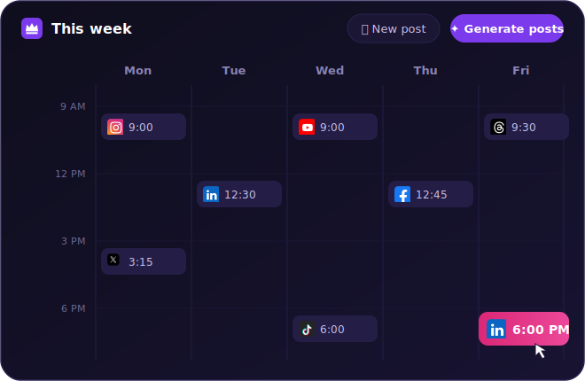
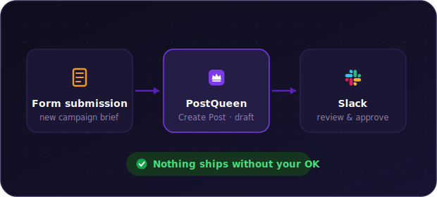
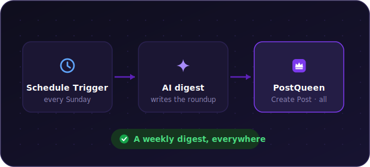
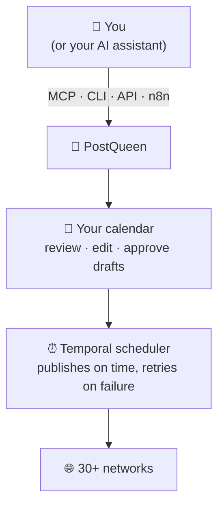
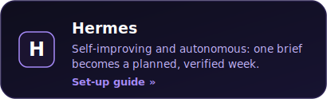

<p align="center">
  <a href="https://postqueen.ai">
    
  </a>
</p>

<h3 align="center">
  <a href="https://postqueen.ai/agent">🆕 NEW: meet the PostQueen Agent, run your social media from Claude Code, ChatGPT, OpenClaw or Hermes »</a>
</h3>

<br/>

<p align="center">
  <strong>Stop doing social media yourself.</strong>
</p>

<p align="center">
  PostQueen is an AI employee for your social media. Tell her what to share, in one sentence. She writes the copy, designs the visual and schedules it on every channel you have. You just review the calendar.
</p>

<p align="center">
  <strong>Views on autopilot. Posts every day. Launches everywhere.</strong><br/>
  <em>All while you do your actual job.</em>
</p>

<p align="center">
  <strong><a href="https://postqueen.ai">PostQueen</a></strong> is the open-source alternative to <strong>Buffer, Hootsuite, Sprout Social</strong> and <strong>Later</strong>.
</p>

<br/>

<p align="center"></p>

<br/>

<p align="center">
  <a href="https://postqueen.ai">Website</a> &nbsp;·&nbsp;
  <a href="https://postqueen.ai/pricing">Pricing</a> &nbsp;·&nbsp;
  <a href="https://docs.postqueen.ai">Docs</a> &nbsp;·&nbsp;
  <a href="https://api.postqueen.ai/docs">API Reference</a> &nbsp;·&nbsp;
  <a href="https://postqueen.ai/agent">Agents</a> &nbsp;·&nbsp;
  <a href="https://postqueen.ai/mcp">MCP</a> &nbsp;·&nbsp;
  <a href="https://www.npmjs.com/package/postqueen">CLI</a>
</p>

<p align="center">
  <a href="https://www.npmjs.com/package/n8n-nodes-postqueen"></a>
  <a href="https://www.npmjs.com/package/n8n-nodes-postqueen"></a>
  <a href="https://github.com/GkhanKINAY/postqueen-n8n/blob/main/LICENSE.md"></a>
  <a href="https://docs.n8n.io/integrations/community-nodes/"></a>
</p>

<br/>

<p align="center">
  <!-- CHANNEL ICONS: 30 individual imgs, natural flow, mobile-wrap -->
                               
</p>


<br/>

<p align="center"></p>

<br/>

<h3 align="center">Schedule and generate posts with AI</h3>

<p align="center">
  
</p>

<br/>

<p align="center">
  <strong>Free for 7 days in the cloud. Forever free on your own server.</strong>
</p>

<p align="center">
  <a href="https://postqueen.ai"></a>
  &nbsp;&nbsp;
  <a href="https://github.com/GkhanKINAY/postqueen-docker-compose"></a>
</p>

<br/>

---

## 🔁 What you can build

Nine workflows this node makes trivial — every PostQueen step below is a real operation of the node, and any n8n trigger (Schedule, RSS, Webhook, Google Sheets, a form) can start them.

### 🌐 One post, every channel

You (or any n8n node) write the content — PostQueen does the publishing. An AI draft, an RSS item, a row from a sheet: one **Create Post** schedules and publishes it to every channel you have, in a single step.

<p align="center">
  
</p>

### 📰 Blog on autopilot

An **RSS trigger** watches your blog, an AI node writes the caption for each new article, and **Create Post** schedules it to every channel at once.

<p align="center">
  
</p>

### 🎬 Grow a YouTube channel while you sleep

A daily **Schedule Trigger** runs **Generate Video** (`veo3` or `image-text-slides`, vertical or horizontal, with your prompt — even a voiceover: list voices with **Video Function** → `loadVoices`), then **Create Post** queues the finished video to your channel. This is worth a second look: the node exposes AI video generation, an operation that not even the PostQueen CLI has.

<p align="center">
  
</p>

### 📱 One clip → TikTok, Reels and Shorts

A new video file landing in Drive, Dropbox or S3 triggers **Upload File**, and **Create Post** schedules the same clip to TikTok, Instagram and YouTube in one go — the posts array takes as many channels as you like. Upload first and pass the returned path into the post: TikTok, Instagram and YouTube only accept media from trusted domains.

<p align="center">
  
</p>

### 🚀 Launch-day announcement blast

A **form submission** or a new product row landing in a sheet kicks off a multi-channel announcement: **Get Channels** finds your accounts, **Create Post** does the rest — as a draft first if you want a human sign-off.

<p align="center">
  
</p>

### 📝 Drafts with human sign-off

A form submission (or any trigger) runs **Create Post** with type `draft`, and a Slack message asks the team to review — approve it on the calendar and PostQueen takes it from there.

<p align="center">
  
</p>

### ♻️ Evergreen recycler

Every Friday, **Get Posts** pulls your archive, an AI node picks the winners, and **Create Post** re-queues the evergreen ones — your best content keeps working without anyone touching it.

<p align="center">
  
</p>

### 🗞️ Sunday digest

Every Sunday, an AI node writes the week's roundup and **Create Post** sends it to every channel — a newsletter-grade digest with zero manual steps.

<p align="center">
  
</p>

### 🛡️ Queue guard

Every Monday, **Get Posts** pulls the next seven days of your calendar; if the queue looks empty, a Slack message tells you before your followers notice.

<p align="center">
  
</p>

<br/>

<p align="center"></p>

<br/>

## 📦 Installation

### n8n UI (recommended)

1. Open **Settings → Community Nodes**.
2. Click **Install**.
3. Enter `n8n-nodes-postqueen` as the npm package name.
4. Click **Install**.


### npm (manual, non-Docker)

Go to your n8n installation folder (usually `~/.n8n`). If there is no `custom` folder, create one with a `package.json`, then install the package:

```bash
mkdir -p ~/.n8n/custom
cd ~/.n8n/custom
npm init -y
npm install n8n-nodes-postqueen
```

### Docker

Create a folder on your host machine for custom nodes and install the package there:

```bash
mkdir -p ~/n8n-custom-nodes
cd ~/n8n-custom-nodes
npm init -y
npm install n8n-nodes-postqueen
```

Then mount that folder into the container (host path to `/home/node/n8n-custom-nodes`) and point n8n at it:

```bash
docker run -d --name n8n \
  -v ~/n8n-custom-nodes:/home/node/n8n-custom-nodes \
  -e N8N_CUSTOM_EXTENSIONS="/home/node/n8n-custom-nodes" \
  -p 5678:5678 n8nio/n8n
```

Requires n8n running on Node.js **>=20.15**.

<br/>

<p align="center"></p>

<br/>

## 🔑 Credentials

The node authenticates with a **PostQueen API** credential that has two fields:

| Field | Description |
| --- | --- |
| **API Key** | Your PostQueen Public API key. Grab it at **[app.postqueen.ai/settings](https://app.postqueen.ai/settings)** (Developers → Public API → Reveal). |
| **Host** | Base URL of the PostQueen API. Defaults to `https://api.postqueen.ai` (cloud). |

To add the credential in n8n, create a new **PostQueen API** credential, paste your API key, and (if self-hosting) set the host. n8n validates it against a live test endpoint when you save.

> **Self-hosting note:** point **Host** at your own instance's API base URL. It must end with `/api`, for example `https://yourdomain.com/api`.

<br/>

<p align="center"></p>

<br/>

## ⚙️ Operations

The PostQueen node exposes 7 operations:

| Operation | Description |
| --- | --- |
| **Create Post** | Schedule, draft, or immediately publish a post to one or more channels. |
| **Delete Post** | Delete a post by its ID. |
| **Generate Video** | Generate a video with AI (see parameters below). |
| **Get Channels** | List your connected channels (integrations). |
| **Get Posts** | List posts within a start/end date range, optionally filtered by customer. |
| **Upload File** | Upload a file (image or video) from a binary property. |
| **Video Function** | Run a video helper function, such as loading available voices. |

**Generate Video** takes a **Video Type** (for example `image-text-slides` or `veo3`), an **Output Format** (`vertical` or `horizontal`), and optional **Custom Parameters** (key/value pairs such as `prompt`, `voice`, or `images`).

<br/>

<p align="center"></p>

<br/>

## 🤝 Works with the rest of the platform

The node talks to the same public API as the [CLI](https://www.npmjs.com/package/postqueen), the [SDK](https://www.npmjs.com/package/@postqueen/node) and the [MCP server](https://postqueen.ai/mcp), so whatever you automate here plays nicely with whatever your AI assistant does through [postqueen-agent](https://github.com/GkhanKINAY/postqueen-agent). The full API is browsable in the [Swagger reference](https://api.postqueen.ai/docs) and explained in the [public API docs](https://docs.postqueen.ai/public-api/introduction). Make.com and Zapier can call the same API directly, no node required.

<br/>

<p align="center"></p>

<br/>

## ⚙️ How she works



1. **Say it once.** From the app, WhatsApp, your terminal or ChatGPT.
2. **She does the work.** Research, platform-specific copy, and an image or video to match.
3. **You get the final word.** Everything waits on your calendar: edit it, delete it, or keep drafts until you approve them.
4. **It goes out on time.** A [Temporal](https://temporal.io) workflow engine fires every post exactly when planned, with automatic retries, and refreshes your platform tokens in the background.

Curious about the internals? Read [how it works](https://docs.postqueen.ai/howitworks) in the docs.

<br/>

---

## 🌙 An agent that works while you sleep

Agents like **Hermes** and **OpenClaw** can run on a schedule, not just on demand. A small recurring job wakes up every morning, checks yesterday's numbers with `analytics:platform`, and drafts today's post before you have had coffee. Every PostQueen action is a CLI command or an MCP call with clean JSON output, so any agent that can run a command can run your social media.

<p align="center">
  
</p>

**Any other agent works too:** Gemini CLI, Aider, Cline, Warp, Windsurf, or your own scripts. Start from the [Agent guide](https://postqueen.ai/agent) or the [MCP guide](https://postqueen.ai/mcp), and see the full command reference in [postqueen-agent](https://github.com/GkhanKINAY/postqueen-agent).

<br/>

---

## 🦞 Meet her open agents: OpenClaw &amp; Hermes

The two open-source agents everyone is running right now both speak PostQueen natively. **OpenClaw** lives on your machine and answers you from any chat app. **Hermes** does that too — and give it one brief, it plans your whole week on its own. Both drive the same `postqueen` CLI.

<p align="center">
  
</p>

<a href="https://postqueen.ai/openclaw"></a> <a href="https://postqueen.ai/hermes-agent"></a>

**Any other agent works too** — anything that can run a CLI command or call MCP can run your socials. [Agent guide »](https://postqueen.ai/agent)

<br/>

---

## 🚀 Get started in minutes

<br/>

<p align="center"></p>

<br/>

### ☁️ Cloud, the fast lane

Skip the setup entirely. Create an account, connect your channels, and schedule your first post today: **7-day free trial**, nothing to install, nothing to run.

<p align="center">
  <a href="https://postqueen.ai"></a>
</p>

<br/>

<p align="center"></p>

<br/>

### 🐳 Self-host, the free lane

Your server. Your keys. Your audience. The whole stack runs on your machine with Docker:

```bash
git clone https://github.com/GkhanKINAY/postqueen-docker-compose
cd postqueen-docker-compose
# set a unique JWT_SECRET and your public URLs in docker-compose.yaml
docker compose up -d          # then open http://localhost:4007
```

<p align="center">
  
</p>

You will need Docker, about 4 GB of RAM, and for connecting real social accounts a public HTTPS domain behind a reverse proxy (the networks send their OAuth callbacks there). The stack ships the app, PostgreSQL, Redis and Temporal.

Full walkthrough: [self-host guide](https://docs.postqueen.ai/installation/docker-compose) &nbsp;·&nbsp; Kubernetes: [postqueen-helmchart](https://github.com/GkhanKINAY/postqueen-helmchart) &nbsp;·&nbsp; every setting: [configuration reference](https://docs.postqueen.ai/configuration/reference)

<br/>

---

## 🌐 Publish everywhere

Write once, be everywhere. PostQueen publishes to **30+ networks** out of the box:

<p align="center">
                               
</p>

| Category | Networks |
| --- | --- |
| **Major social** | X, LinkedIn, Instagram, Facebook, TikTok, YouTube, Threads, Pinterest, Reddit, Bluesky |
| **Community and chat** | Discord, Slack, Telegram, Mastodon, Twitch, Kick, MeWe, VK |
| **Publishing and blogs** | WordPress, Medium, Dev.to, Hashnode, Tumblr, Listmonk, Moltbook |
| **Web3 and decentralized** | Nostr, Farcaster, Lemmy |
| **Creator and business** | Google Business Profile, Whop, Skool, Dribbble |

LinkedIn and Instagram each support both personal and page posting. New connectors ship regularly: see the full list with per-network guides at [postqueen.ai/channels](https://postqueen.ai/channels).

<br/>

---

## 🛡️ Compliance

- PostQueen is an open-source, self-hostable social media scheduler that supports X, LinkedIn, Instagram, Bluesky, Mastodon, Discord and 30+ more.
- The hosted service uses official, platform-approved OAuth flows.
- PostQueen does not automate or scrape content from social media platforms.
- PostQueen does not collect, store, or proxy API keys or access tokens from users.
- PostQueen never asks users to paste social-platform credentials into the hosted product.
- Users always authenticate directly with each platform (X, LinkedIn, Discord, and so on), which keeps every platform's compliance and your data privacy intact.

<br/>

---

## ❤️ Community and support

- 🐛 **Found a bug or have an idea?** [Open an issue](https://github.com/GkhanKINAY/postqueen-n8n/issues).
- 💌 **Need a hand?** Email **support@postqueen.ai**.
- 📚 **Getting started?** The [docs](https://docs.postqueen.ai) walk you through everything.
- 🤝 **Want to contribute?** Start with the [contribution guide](https://github.com/GkhanKINAY/postqueen-app/blob/main/CONTRIBUTING.md); security reports go to [SECURITY.md](https://github.com/GkhanKINAY/postqueen-app/blob/main/SECURITY.md).

If PostQueen saves you time, a ⭐ on the repo genuinely helps other people find it.

<br/>

---

## 🙏 Thank you, Postiz

PostQueen is a fork of [Postiz](https://github.com/gitroomhq/postiz-app) by Nevo David, released under AGPL-3.0. Postiz gave us a rock-solid open-source scheduler: the connectors, the calendar, the Temporal pipeline, years of careful work that we did not have to redo. We forked it because we wanted to take that foundation in a specific direction, a social media manager you talk to instead of operate, and building on Postiz let us start from something that already worked.

Thank you, Nevo David and every Postiz contributor. This project exists because you chose to open-source yours. If PostQueen is not quite what you need, [Postiz](https://postiz.com) itself might be, and it deserves your star too. 🙏

<br/>

---

## 👑 The PostQueen ecosystem

| Repository | What lives there |
| --- | --- |
| [postqueen-app](https://github.com/GkhanKINAY/postqueen-app) | The application itself: frontend, backend, workers |
| [postqueen-agent](https://github.com/GkhanKINAY/postqueen-agent) | Agent CLI and skill: give any AI assistant hands |
| [postqueen-docker-compose](https://github.com/GkhanKINAY/postqueen-docker-compose) | Self-host the whole stack with one command |
| [postqueen-helmchart](https://github.com/GkhanKINAY/postqueen-helmchart) | Run it on Kubernetes |
| [postqueen-n8n](https://github.com/GkhanKINAY/postqueen-n8n) | The n8n community node for no-code automation |
| [postqueen-docs](https://github.com/GkhanKINAY/postqueen-docs) | Source of [docs.postqueen.ai](https://docs.postqueen.ai) |

On npm: [`postqueen`](https://www.npmjs.com/package/postqueen) (CLI) · [`@postqueen/node`](https://www.npmjs.com/package/@postqueen/node) (SDK) · [`n8n-nodes-postqueen`](https://www.npmjs.com/package/n8n-nodes-postqueen) (n8n)

<br/>

<p align="center">
  <strong>Long live the queen.</strong> 👑
</p>

<p align="center">
  <a href="https://postqueen.ai"></a>
  &nbsp;&nbsp;
  <a href="https://github.com/GkhanKINAY/postqueen-docker-compose"></a>
</p>

## License

This node package is released under the [MIT license](LICENSE.md).

This node is a fork of the [Postiz](https://github.com/gitroomhq/postiz-app) community node. Thanks to Nevo David and the Postiz contributors for the foundation this builds on.
