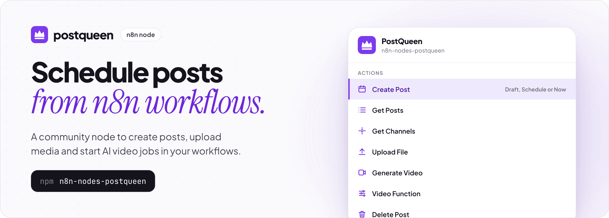
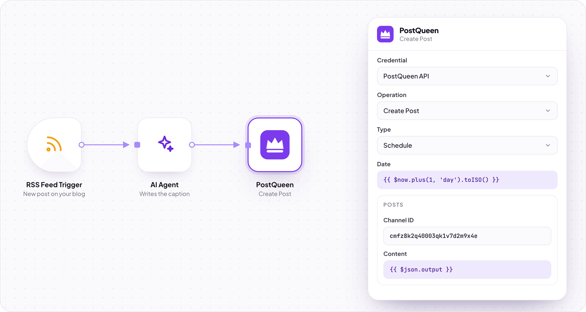
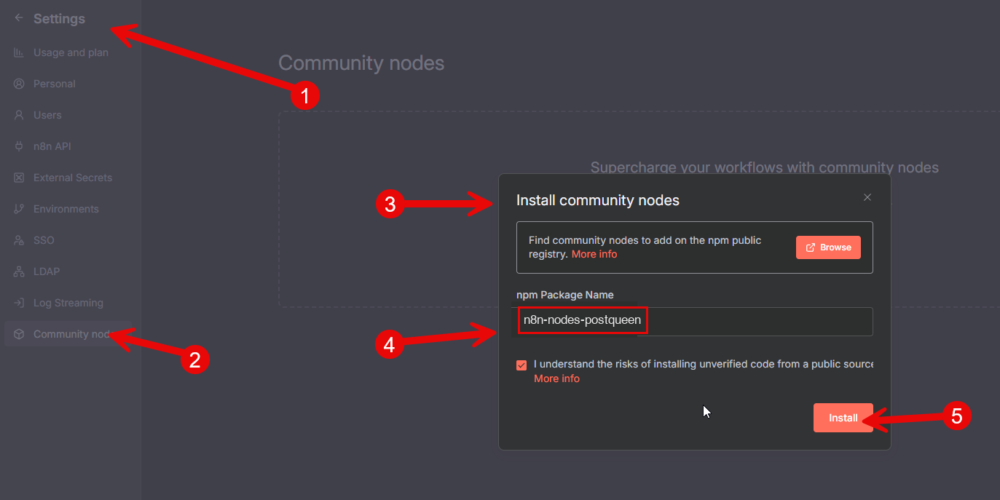

<p align="center">
  <picture>
    <source media="(prefers-color-scheme: dark)" srcset=".github/assets/banner-dark.png">
    
  </picture>
</p>

<p align="center">
  <code>n8n-nodes-postqueen</code> is an n8n community node for PostQueen: create, list and delete posts, upload media and start AI video jobs from any workflow.
</p>

<p align="center">
  <a href="https://postqueen.ai"><b>Website</b></a> ·
  <a href="https://docs.postqueen.ai/automation/n8n"><b>Docs</b></a> ·
  <a href="https://postqueen.ai/pricing"><b>Pricing</b></a> ·
  <a href="https://www.npmjs.com/package/n8n-nodes-postqueen"><b>npm</b></a>
</p>

<p align="center">
  <a href="https://www.npmjs.com/package/n8n-nodes-postqueen"></a>
  <a href="LICENSE.md"></a>
</p>

## What it does

- **Create Post** schedules a post, saves it as a draft or publishes it now, on one or more channels in a single call.
- **Get Posts**, **Get Channels** and **Delete Post** read and tidy your calendar.
- **Upload File** sends a file from the workflow to PostQueen and returns the path to use in a post.
- **Generate Video** and **Video Function** start a video with one of the app's video types and run its helpers, such as listing voices.

<picture>
  <source media="(prefers-color-scheme: dark)" srcset=".github/assets/workflow-dark.png">
  
</picture>

[PostQueen](https://postqueen.ai) is a social media scheduler with an AI copilot that posts to 30+ networks. The node calls the PostQueen public API, so everything it creates shows up on the same calendar as the app.

## Quick start

1. In n8n, open **Settings > Community Nodes**, choose **Install**, enter `n8n-nodes-postqueen` and install it.
   <details><summary>Show the install dialog</summary>

   

   </details>
2. Create a **PostQueen API** credential. Paste your API key: in PostQueen, open Connections > API Keys to copy it. Only workspace admins can see the key, and each workspace has one.
3. Keep **Host** at `https://api.postqueen.ai`. If you run PostQueen yourself, set it to your instance's API address, ending in `/api`, such as `https://postqueen.example.com/api`.
4. Add the PostQueen node to a workflow and pick an operation.

n8n checks the credential against the API when you save it. The node needs n8n on Node.js 20.15 or newer. No PostQueen account yet? [Start a 7-day trial, $0 due today](https://postqueen.ai/pricing).

**Without the Community Nodes screen.** Install the package into n8n's custom folder, then restart n8n:

```bash
mkdir -p ~/.n8n/custom && cd ~/.n8n/custom
npm init -y
npm install n8n-nodes-postqueen
```

In Docker, install it into a folder on the host, mount that folder into the container and set `N8N_CUSTOM_EXTENSIONS` to its path inside the container.

## Operations

| Operation | What it does |
| --- | --- |
| Create Post | Create a post with type **Draft**, **Schedule** or **Now**, for one or more channels. The type defaults to **Now**, so pick Draft while you test. |
| Delete Post | Delete a post by its ID |
| Generate Video | Start a video: **Video Type** is one of the app's video types, such as `image-text-slides`; **Output Format** is vertical or horizontal; **Custom Parameters** carries the inputs that type expects |
| Get Channels | List your connected channels and their IDs |
| Get Posts | List posts between two dates, with an optional customer filter |
| Upload File | Upload an image or video from a binary property |
| Video Function | Run a helper of a video type, such as `loadVoices` |

Video generation uses the AI video credits of your plan. Each network may also need settings of its own on Create Post; the [public API docs](https://docs.postqueen.ai/public-api/introduction) list them per network.

### Workflow ideas

- **Blog to posts:** an RSS trigger watches your blog, an AI node writes the caption, and Create Post schedules it on your channels.
- **Drafts for review:** any trigger runs Create Post with type Draft, and a Slack message asks the team to check it on the calendar.
- **Queue check:** a weekly Schedule Trigger runs Get Posts for the next seven days and messages you if the week is empty.

## Privacy and security

- Channels connect through each network's official OAuth sign-in where the network offers one.
- Some networks, such as Bluesky, Lemmy, WordPress and Nostr, need an app password, an account password or a key that you paste in.
- PostQueen stores these credentials so it can post for you, and replaces them when you remove the channel.
- n8n keeps your PostQueen API key in its own credential store. The key gives full access to the workspace.
- Read the [privacy policy](https://postqueen.ai/privacy-policy), or [delete your account](https://postqueen.ai/delete-my-account).

## Links

| | |
| --- | --- |
| Docs | [n8n guide](https://docs.postqueen.ai/automation/n8n) · [public API](https://docs.postqueen.ai/public-api/introduction) |
| API reference | [api.postqueen.ai/docs](https://api.postqueen.ai/docs) |
| npm | [`n8n-nodes-postqueen`](https://www.npmjs.com/package/n8n-nodes-postqueen) |
| Repositories | [app](https://github.com/GkhanKINAY/postqueen-app) · [CLI and skill](https://github.com/GkhanKINAY/postqueen-agent) · [n8n node](https://github.com/GkhanKINAY/postqueen-n8n) · [docs](https://github.com/GkhanKINAY/postqueen-docs) · [Docker Compose](https://github.com/GkhanKINAY/postqueen-docker-compose) · [Helm chart](https://github.com/GkhanKINAY/postqueen-helmchart) |
| Help | support@postqueen.ai · [GitHub issues](https://github.com/GkhanKINAY/postqueen-n8n/issues) |

## License

This node is open source under the [MIT license](LICENSE.md). PostQueen started as a fork of [Postiz](https://github.com/gitroomhq/postiz-app) by Nevo David, and this node started from [postiz-n8n](https://github.com/gitroomhq/postiz-n8n).
